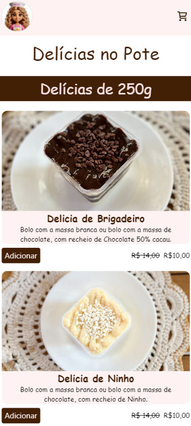

# Loja de bolo de pote

Projeto em React + Typescript
fazendo uma Loja

Projeto desenvolvido por mim, Site: [Steve](https://deliciasdamanda.vercel.app/)

### Instalação

- `npm install` / `npm i`

### Para rodar

- `npm rum dev` / `npm start`

### Esse é um Website, que foi pedido para uma cliente que desejava um site basico para sua loja virtual.

